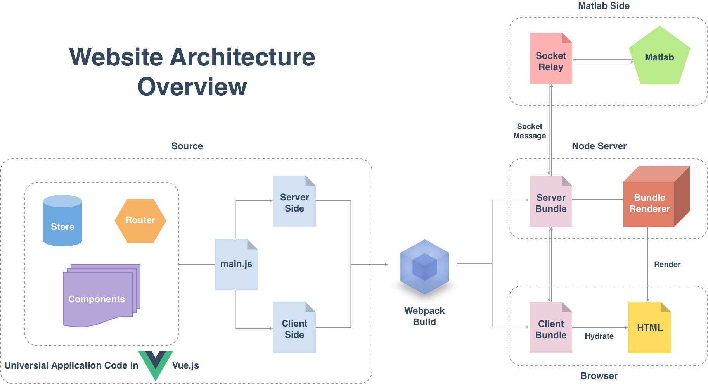

# Structure

Explaination for the whole structure of this web-server.

## Introduction

This web-server is a Vue.js project, base on vue-webpack template, with bulma, chart.js and font awesome. This is based on vue 2.x, vue-router 2.x and vuex.

## Overview

The structure of the entire site consists of the following three parts:

* Web-server fronted
* Web-server backend
* Matlab side

Under construction. Please see [chinese docs](/#/zh-Hans/structure).

